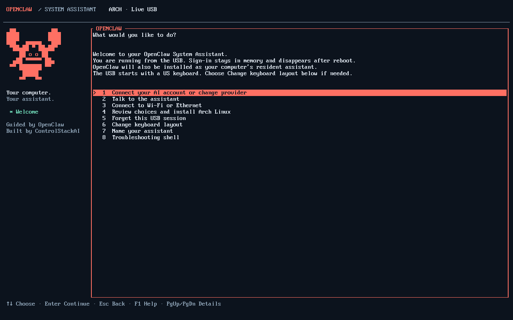
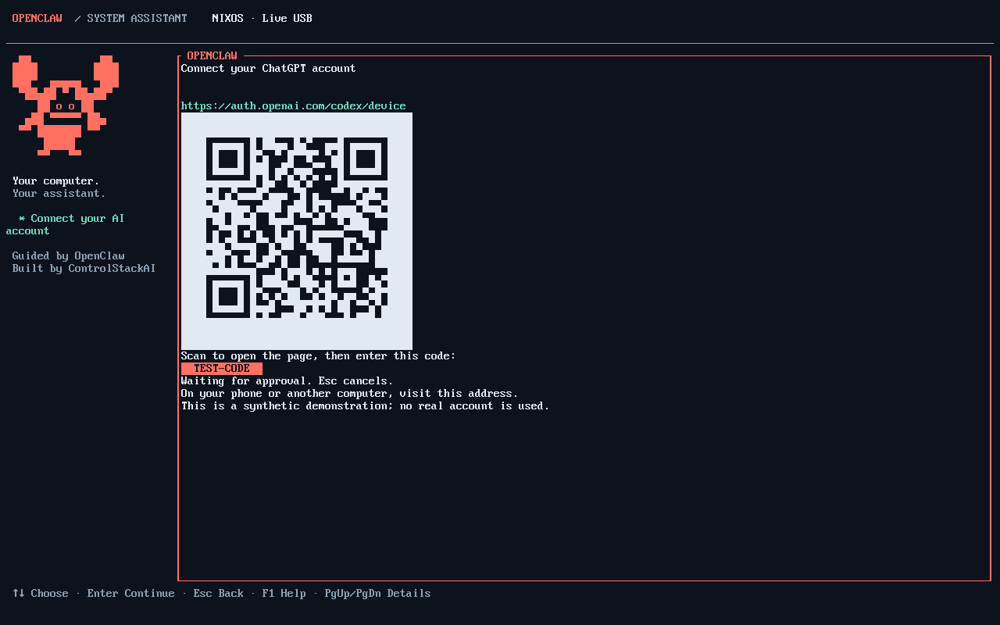
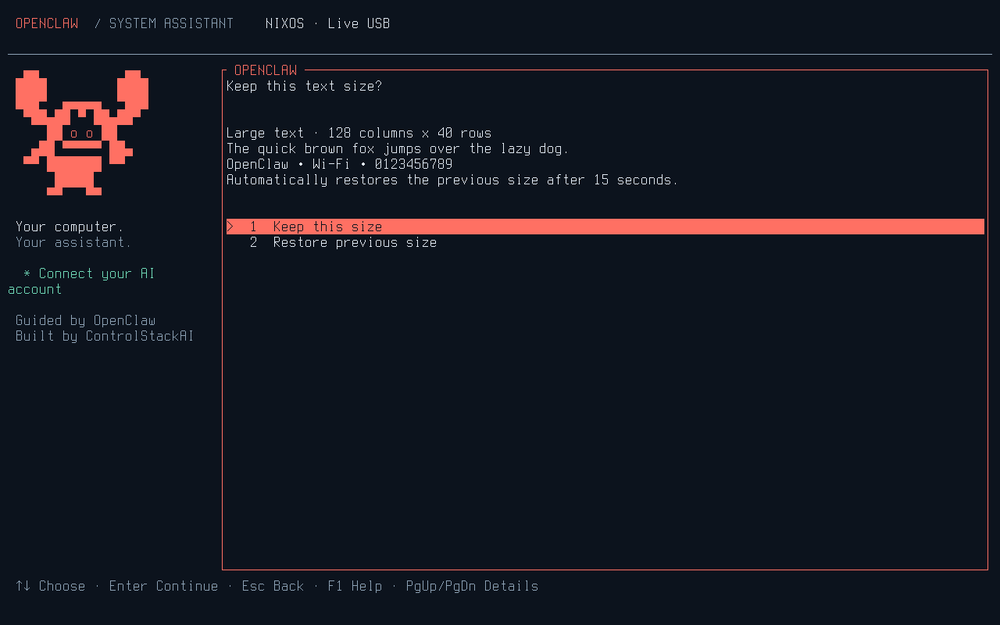

# OpenClaw console interface

The Arch and NixOS images include a Rust/Ratatui front end for their existing
local setup operations. It uses an original block-art claw mascot, a navy/coral
palette, a current-step panel and keyboard navigation. Linux virtual consoles
receive a temporary 16-colour palette; modern terminals use the corresponding
terminal palette. Leaving the interface restores terminal mode and colours.
The layout collapses its large artwork on narrow terminals. No graphical session,
image protocol, emoji font or internet download is needed to display it.

Arrow keys select, number keys jump to an option, Enter continues and Esc returns
from a prompt. F1 explains the controls. Page Up/Down scroll review details.
Password fields mask text and do not add it to activity messages. The separate
exact-disk confirmation and the existing installation executor are unchanged.
Active disk installation is not advertised as safely cancellable.

## Provider connection

Connecting an account stays in Ratatui. A small version-gated Node bridge uses
the pinned OpenClaw provider-auth orchestration with our own prompter. The official
provider implementation owns OAuth, refresh credentials, auth-store persistence
and model selection. OpenClaw's general onboarding wizard is not launched.

ChatGPT displays the official short verification address, a QR code immediately
below it, and the device code. The QR opens `https://auth.openai.com/codex/device`
on a phone; the owner still enters the displayed pairing code. It contains only
the public address, never credentials or the pairing code. The interface waits
for approval, and offers Esc to cancel. Retrying requests a fresh code. OpenAI API
keys enter through a protected Ratatui field and private pipe; they are not command
arguments or renderer logs. The other-provider choice uses OpenClaw's provider
and method catalog. Additional provider methods remain individually unqualified;
unsupported prompt types fail with a retryable explanation. Small terminals retain
the address and code and explain how to enlarge the terminal to show a complete QR; a cropped QR is never deliberately displayed.

Only the dedicated agent account runs the authentication helper. The gateway is
stopped during configuration and restarted afterward, including on cancellation.
Live state remains private RAM state. Installed authentication and conversations
remain persistent, and live credentials are never transferred. Account storage
success is not proof of working model access: the next conversation checks a reply.

The integration deliberately pins OpenClaw 2026.9.5 on NixOS and 2026.9.9 on Arch.
It uses a version-checked upstream module surface, not a promised stable public
API. Updating a runtime requires rerunning the provider integration tests.

## Installation and installed use

The usual desktop, account, regional and encryption questions use Ratatui, and the
full disk/storage/access review precedes exact disk confirmation. A mistyped
`ERASE <disk identifier>` now offers Try again or Cancel installation while keeping
the prepared plan. The phrase must still match exactly; no password prompt or
disk write follows a mismatch. Type CANCEL or press Escape to leave confirmation.
This behavior is included and tested in the INSTALL-RECOVERY ISOs; the earlier
SYSTEM-ACCESS images do not include it. Choosing an
assistant name updates its identity; the reviewed name carries into the installed
system alongside the non-secret owner preferences. Existing identity role and
instructions are preserved.

The same setup interface starts after installed login. The native OpenClaw chat
TUI, NetworkManager's nmtui and the advanced administrator shell currently run as
full-screen child applications; Ratatui restores itself when they return. This
first version does not implement a new chat client or a new Wi-Fi manager.
An administrator can use `system-agent-setup --plain` for the text-only fallback.

## Verification

`checks.x86_64-linux.tui-vm` renders real console screenshots and checks device-code
display and independent QR decoding from the console screenshot, navigation/cancellation, password masking, disk review and terminal exit.
Unit tests cover late replies after cancellation and assistant-name validation.
`scripts/qualify-tui-auth.py` runs against both exact packaged runtimes inside an
empty network namespace, using fresh state and synthetic credentials. Its device
provider fixture leaves the official orchestration and credential storage intact.
The upstream device-code transport has a separate synthetic URL/poll/exchange test.
These do not qualify real account authentication.

The full image test drives the shipped Ratatui interview and disk confirmation on
the primary console, then checks the installed system with the ISO removed.
See the exact artifact receipts in [qualification](qualification.md).

## Anthropic authentication

Both pinned OpenClaw versions expose Anthropic Claude CLI (`cli`),
`setup-token` and `api-key` methods through **Another provider**. Neither exposes
the OpenAI-style short device-code pairing method. These Anthropic routes have
not been qualified through this interface; a QR graphic alone cannot supply a
missing provider pairing protocol. The resident account also does not import the
desktop owner's Claude credentials. See the current
[OpenClaw Anthropic documentation](https://docs.openclaw.ai/providers/anthropic).

## Live-console text size

On either live ISO, choose **Text size** from the opening setup menu. Small (14),
Standard (16), Large (20), and Extra large (24) use packaged Unicode Terminus
console fonts. Standard is the initial default. This changes the actual local
Linux console, including troubleshooting text; it does not configure Ghostty or
desktop scaling. Serial terminals and graphical terminal windows are excluded.

A selection immediately previews sample text and asks **Keep this text size?**.
Confirm within 15 seconds, or the previous font and Unicode map are restored.
Escape and closing the interface also restore the previous font. An independent
watchdog owns restoration, so losing the setup process cannot keep an unconfirmed
preview. Sizes leaving fewer than 60 columns or 18 rows are rejected immediately.

Confirmed choices are stored per console under `/run/controlstack-console`, so
reopening setup keeps the size for this live boot. They disappear after reboot
and are not copied into the installed system. The QR code remains conditional on
having enough screen space to display it completely.
